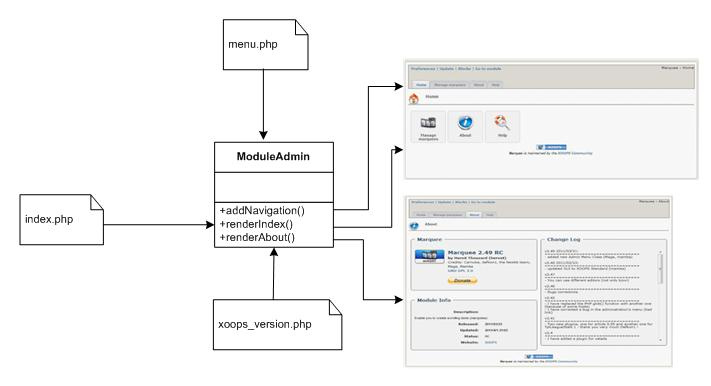

# Introduction

#### _XOOPS Documentation Series_

## XOOPS ModuleAdmin Framework

**for XOOPS 2.5.4+**

### Developer Manual

© 2015 The XOOPS Project \([http://xoops.org](http://xoops.org)\)

#### Framework Purpose

The ModuleAdmin Framework provides standardized GUI for the Administration Control Panel for all XOOPS modules compatible with XOOPS 2.5. It allows to manage the visual part of the administration of any module in a consistent way, thus making it more user friendly.

## Table of Content

* [Installation](installation.md)
* [Configuration of xoops\_version.php](configuration-of-xoops_version.php.md)
* [Configurations of the usage of the Frameworks](configurations-of-the-usage-of-the-frameworks.md)
* [The admin menu](the-admin-menu.md)
* [The help section of the module](the-help-section-of-the-module.md)
* [Addition of a info box](addition-of-a-info-box.md)
* [Addition of a navigation](addition-of-a-navigation.md)
* [Addition of a button](addition-of-a-button.md)
* [The page "index.php"](the-page-index.php.md)
* [The page "about.php"](the-page-about.php.md)
* [Credits](credits.md)

