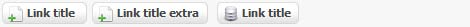

# Addition of a button

The button is composed from an image and a title, and it allows to create a link. To create a button, we use `addItemButton()`:

```php
$variable_name->addItemButton($title, $link, $icon, $extra);
```

* `$title`: Link title. 
* `$link`: URL of the link. 
* `$icon`: Image that exists before the link. Values are: 'add' or 'list'. 
* `$extra`: Text after the title. 

To display the buttons, we use `renderButton()`:

```php
$variable_name -> renderButton($position, $delimeter);
```

* `$position` : Position of the buttons. Values are: 'left', 'center' or 'right'. 
* `$delimeter` : Demarcation between the buttons. The default: ' '. 

We can add as many buttons as we need.

**Example:** 

```php
$variable_name = new ModuleAdmin(); 
$variable_name->addItemButton('Link title', 'index.php', 'add' , '');
$variable_name->addItemButton('Link title', 'index.php', 'add' , 'extra');
$variable_name->addItemButton('Link title', 'index.php', 'list' , ''); echo
$variable_name->renderButton('left', '');
```

**The result:** 



