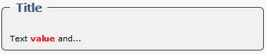
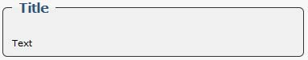
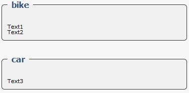

# Addition of a info box

The info box is a text zone composed from a title and of a text. To create a infobox, we use `addInfoBox()`:

$variable\_name-&gt;addInfoBox\($title\);

$title: info box title.

To add a line in the Info box, we use addInfoBoxLine\(\) :

```php
$variable_name->addInfoBoxLine($title, $text, $value, $color, $type);
```

* `$title` : Info box title \(similar to the one used with "addInfoBox"\). 
* `$text` : Text to be shown in the info box. 
* `$value` : Value to appear in the text. 
* `$color` : Value color. 
* `$type` :. Values: 'default' or 'information'. 

The type 'default' uses all the parameters. It displays a text that includes the variable $value of the color 'color'.

**Example:** 

```php
$variable_name->addInfoBox("Title"); 
$variable_name->addInfoBoxLine("Title", 'Text %s and...', 'value', 'red', 'default');
```

The result:



The type 'information' uses only the parameters '$text'. It displays only a text.

**Example:**

```php
$variable_name->addInfoBox("Title"); 
$variable_name->addInfoBoxLine("Title", 'Text', '', '', 'information');
```

**The result:** 



To display the infos box, we use `renderInfoBox()`:

```php
$variable_name -> renderInfoBox();
```

Info boxes are automatically displayed in the pages "`index.php`" and "`about.php`" if you are using functions that handle these parts.

You can add as many lines as you want in a info box and you can put as many infos box as you wish. Those are the infos box title that can link the right lines with the correct infos box.

**Example:** 

```php
$variable_name = new ModuleAdmin(); 
$variable_name->addInfoBox("bike"); $variable_name->addInfoBox("car");
$variable_name->addInfoBoxLine("bike", 'Text1', '', '', 'information');
$variable_name->addInfoBoxLine("bike", 'Text2', '', '', 'information');
$variable_name->addInfoBoxLine("car", 'Text3', '', '', 'information'); 
echo $variable_name -> renderInfoBox();
```

**The result:** 



