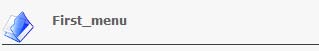

# Addition of a navigation

The navigation feature allows to put a picture with the title of the section where we are. The image and title are automatically created.

To add navigation we use `addNavigation()`:

```php
$variable_name->addNavigation($file);
```

`$file`: Page title with extension \(note, put the same names as those in menu.php\).

**Example :** 

```php
$variable_name = new ModuleAdmin(); $variable_name->addNavigation("fist_menu.php"); 
echo $variable_name -> renderLabel();
```

**The Result:** 



