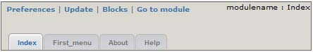

# 4.0 The admin menu

To create the administration menu, we put in xoops_version.php : 

```$modversion['system_menu'] = 1; ```

This instruction automatically enables a navigation menu inside the administration area of the module : 


 
The upper part is automatically generated and tabs are created by the ```menu.php``` file located in: 

    modulename 
        L admin 
            L menu.php. 

The menu.php file must have the following structure: 

```php
$adminmenu[1]['title'] = _MI_MODULENAME_INDEX; $adminmenu[1]['link'] = "admin/index.php";
$adminmenu[1]['icon'] = "images/admin/home.png"; 
$adminmenu[2]['title'] =_MI_MODULENAME_FIRSTMENU; 
$adminmenu[2]['link'] = "admin/firstmenu.php"; 
$adminmenu[2]['icon'] = "images/admin/firstmenu.png"; 
$adminmenu[3]['title'] = _MI_MODULENAME_ABOUT; 
$adminmenu[3]['link'] = "admin/about.php"; 
$adminmenu[3]['icon'] = "images/admin/about.png"; ```

```$adminmenu[id]['title'] ```

Variable in which you indicate the title of the link. 

```$adminmenu[id]['link'] ```

Variable in which you specify the link path 

```$adminmenu[id]['icon'] ```

Variable in which you specify icons path. This icon is used by the Admin theme and by the index menu generated by the Framework. The icons to the page "Index" and "About" should always be the same, for the other icons you are free. 

All icons should have a size 32px x 32px 
