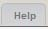

# The help section of the module

To create a Help section we added in xoops\_version.php :

`$modversion['help'] = 'page=help';`

This instruction automatically enables a help button in the navigation tab of the module's administration :



Also, it enables to create a Menu in the Admin Index page :


The help template exists is in the language file so it can be translated for each language. The structure is as follows:

```text
modulename 
    L language 
        L english 
            L help 
                L help.html 
```

Please view the template help TDMDownloads module to see how it is constructed.

