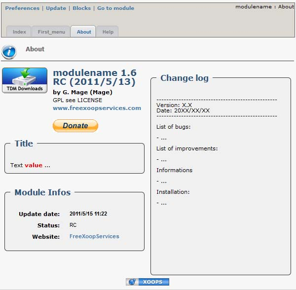

# The page "about.php"

The page "About us" is composed from 4 parties:

1. A summary of the module information \(automatically generated from xoops\_version-php\) as a info box. 
2. Custom infos box if desired. 
3. A info box with information about the module \(automatically generated from xoops\_version.php\). 
4. The module's changelog. 

To create the page "About us", we use renderabout\(\):

```php
$variable_name->renderabout($paypal, $icon);
```

* `$paypal`: Your payal ID,if you want a "donate" button so users can make donations. 
* `$icon`: Values 'True' if you want to put xoops image in the footer and 'False'if you do not want. 

The changelog will be automatically loaded, but you must put in:

```text
modulename 
    L docs 
        L changelog.txt 
```

Or in:

```text
modulename 
    L language 
        L Local_Language (e.g. French) 
            L changelog.txt 
```

The changelog will be automatically loaded into the language of the website. If not, it will be loaded from the folder "docs".

You can also add as many InfoBoxes as you want in this section

**Example:** 

```php
$variable_name = new ModuleAdmin(); 
$variable_name->addInfoBox("Title"); 
$variable_name->addInfoBoxLine("Title", 'Text %s ...', 'value', 'red', 'default'); 
echo $variable_name->addNavigation('about.php'); 
echo $variable_name->renderabout('9MYQB7GUK5MCS', true);
```

**The result:**



