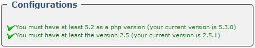
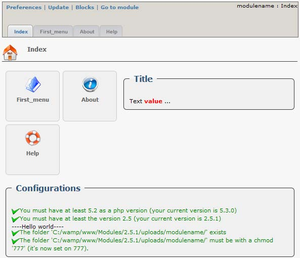

# The page "index.php"

The index page is composed from 3 parts :

1. A menu \(automatically generated\) 
2. Custom infos box if desired. 
3. A configuration info box. 

To create an index, we use`renderIndex()`:

```php
$variable_name->renderIndex();
```

By default there are only 2 configurations listed :

1. PHP Version \(obtained from the variable `$modversion['min_php']` inside xoops\_version.php\). 
2. XOOPS version \(obtained from the variable `$modversion['min_xoops']` inside xoops\_version.php\). 

If both variables are defined in `xoops_version.php`, we get automatically this info box:



We can add 3 other types of configuration. 1. Display text. 1. Verifying the existence of a file. 1. Checking the chmod of a file.

To add a configuration line, on we use `addConfigBoxLine()`:

```php
$variable_name->addConfigBoxLine($value, $type);
```

* `$value` : With type 'folder' we have to put the folder path. With type 'chmod' we have to put a table with the folder path as a first parameter and the desired chmod as as a second one. 
* `$type` : 'default', 'folder' or 'chmod'. 

**Example:** 

```php
$variable_name = new ModuleAdmin(); 
$variable_name->addInfoBox("Title"); 
$variable_name->addInfoBoxLine("Title", 'Text %s ...', 'value', 'red', 'default');
$variable_name->addConfigBoxLine('----Hello world----', 'default'); 
$folder = XOOPS_ROOT_PATH . '/uploads/modulename/'; 
$variable_name->addConfigBoxLine($folder, 'folder');
$variable_name->addConfigBoxLine(array($folder, '777'), 'chmod'); 
echo $variable_name->addNavigation('index.php'); 
echo $variable_name->renderIndex();
```

**The Result:** 



